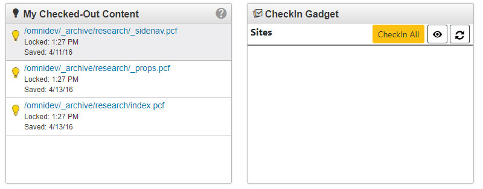

# gadget-checkin v1.0.1 [](https://travis-ci.org/jessgusclark/gadget-checkin)

This gadget displays the number of files currently checked out to the user in each site and gives the user the option to check them all back in.


## Version v1.0.1

No longer in development, v1 is ready for prime time! It has been a little over two years since this gadget has been refreshed. The latest version includes fixes to prevent files being checked in that are under workflow, scheduled or set to expire. Also, it has gone back to being exclusively a dashboard gadget as the sidebar functionality was causing some issues on the dashboard.

For developers wanting to contribute or explore the code, it has been broken out into different "classes". Also, tests have been added for some of the functionality. The gadget is based on my [Gadget-Starter](https://github.com/jessgusclark/gadget-starter) code that I use for the majority of my OU Gadgets.

## Install

### Clone the repo and host locally

Make sure [npm](https://www.npmjs.com/), and [Gulp](http://gulpjs.com/) are installed on your machine.

```

npm install

gulp

```

Upload the /build folder to your production server (ideally SSL) and install via [OmniUpdate's Instructions](http://support.omniupdate.com/oucampus10/setup/gadgets/new-gadget.html)


### Install via GitHub pages

Make sure you always have the latest version and the quickest install by installing via GitHub.

Using [OmniUpdate's Instructions](http://support.omniupdate.com/oucampus10/setup/gadgets/new-gadget.html), when asked for the URL please use: https://jessgusclark.github.io/gadget-checkin/build/

## Contributing

Yes! Fork and put in a pull request with information about what was changed and why.  Please also include unit tests if functionality requires it.

## Troubleshooting

Report issues in the issues tab. Please report any issues in the issues tab. Be as descriptive as possible including how to reproduce the error.

### "Known" issue, sorta, not really...

Gadgets are not able to update other gadgets on the dashboard. When you click on "Check In" with the _CheckIn Gadget_ it can't access the OU Campus's _My Checked-Out Content_ gadget. So the files in OU's gadget will still look like they are checked out when they aren't. You can verify that they are checked in my refreshing just that widget. This is kinda a bug, but kinda isn't. 

After clicking "Checkin All" with the _CheckIn Gadget_ the _My Checked-Out Content_ still shows checked out files:


